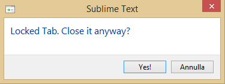

LockTab
========

This plugin allows you to lock (and unlock) a tab in Sublime.
The plugin tries to remember the position of the tab and also the position of the
focus in the view.

This is my first work and it has not the claim to be complete or perfect.
It is (and will remain) a very simple and essential, but I hope useful, plugin but it can
be improved in a lot of aspects.

Right now you can lock only saved-files (or, at least, with a physical path). (See ToDo #9)

Usage
-----
Just right click on the view (right now not on the tab name, see ToDo#4) and Lock/Unlock
the tab.

**Lock:**

**Alert:**

LockTab.sublime-settings is quite self-explained.

**Settings:**

ToDo
----
1. First of all I'm looking for a method for avoiding the normal behavior of sublime.
Right now I just intercept the tab closing, and then I reopen the tab. This is, as far as I
know, the only thing I can do. Right now is not possibile avoiding the tab closure!
Do you know how to do it?

2. One of the most important things to do is to add a particular icon (or also only a different
colour) to the locked tab. I haven't tried it. It could be very easy or impossible. I don't know.

3. Maybe I should improve the code. It just started out as a "bet" in my office. I don't know a lot
neither of phyton nor of sublime plugins.

4. It could be very useful permit the Lock/UnLock of the tab directly from the tab name
and not only on the tab "body". Right now sublime do not give the view ID of the right-clicked
tab name but only of the view on which you have the focus.
Do you know how to do it?

5. Maybe a better english translation of this Readme?

6. Managing more than one group of views. Again didn't try at all.

7. Improving the "set focus" after the reopen

8. Lock a tab -> Save the locked file with a new name. -> Close the tab
Right now the plugin does not forbid the closure. Should I manage it?

9. Managing not-saved files(?)

10. Add a default key-binding.

ChangeLog
=========
I won't annoy you with .md pop-up out of the blue when updating this package, so this is the changelog for every version of this package.

LockTab - 1.1.0
---------------
- Changed IsEnabled in IsVisibile. You won't see the Lock/UnLock menu item every time you right-click on your file. You'll see only the available action. You won't see anything if the file hasn't a path.

- Added the Preferences -> LockTab menu. You can now open the preferences file directly from sublime.
