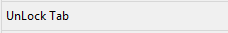
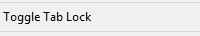

LockTab
========

This plugin allows you to lock (and unlock) a tab in Sublime.
The plugin tries to remember the position of the tab and also the position of the
focus in the view.

This is my first work and it has not the claim to be complete or perfect.
It is (and will remain) a very simple and essential, but I hope useful, plugin but it can
be improved in a lot of aspects.

Right now you can lock only saved-files (or, at least, with a physical path). (See ToDo #7)

Usage
-----
Just right click on the view (right now not on the tab name, see ToDo#3) and Lock/Unlock
the tab.

**Lock, Unlock, Toggle:**

<!--  -->

**Alert:**

**Settings:**
LockTab.sublime-settings is quite self-explained.

**Status Bar Propery:**

ToDo
----
1. **First of all I'm looking for a method for avoiding the normal behavior of sublime.**
Right now I just intercept the tab closing, and then I reopen the tab. This is, as far as I
know, the only thing I can do. **Right now is not possibile avoiding the tab closure!**
**Do you know how to do it?**

2. One of the most important things to do is to **add a particular icon (or also only a different
colour) to the locked tab**. ~~I haven't tried it. It could be very easy or impossible. I don't know.~~
I tried it but the '''set_name''' function changes the name of the tab (my idea was e.g. to add a particular
ascii simbol in the tab name just after the file name) but ALSO the file path! Once I changed the name the file
suddenly appear as dirty, so sublime'll ask for a save.
**Am I doing something wrong?!**

3. It could be very useful permit the Lock/UnLock of the tab directly from the tab name
and not only on the tab "body". Right now sublime do not give the view ID of the right-clicked
tab name but only of the view on which you have the focus.
Do you know how to do it?

4. Managing more than one group of views. Again didn't try at all.

5. Improving the "set focus" after the reopen

6. Lock a tab -> Save the locked file with a new name. -> Close the tab
Right now the plugin does not forbid the closure. Should I manage it?

7. Managing not-saved files(?)

8. ~~Add a default key-binding.~~

ChangeLog
=========

LockTab - 1.1.0
---------------
- Changed IsEnabled in IsVisibile. You won't see the Lock/UnLock menu item every time you right-click on your file. You'll see only the available action. You won't see anything if the file hasn't a path.

- Added the Preferences -> LockTab menu. You can now open the preferences file directly from sublime.

LockTab - 1.2.0
---------------
- Added Toogle Lock Tab command.
You can now use (and see) the toggle command both with a shorcut and from the right-click menu.

- Added *show_toggle* and *hide_all* preferences.
*show_toggle* if true hides the "lock_tab" and "unlock_tab" command from the right-click menu but shows a "Toggle lock tab" command.
*hide_all* if true hides every command from the right-click menu. Useful if you don't want to view anything in the menu (if you have a menu full of functions) and if you want to use just the shortcut.

- Now the "LOCKED" property in the status bar will be shown also when reopening sublime

Thanks To
=========
- [antonioriva](https://github.com/antonioriva)
- [belmat](https://github.com/belmat)